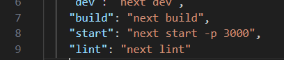

L'application [my_dev_excuses](https://github.com/EtherGys/my_dev_excuses) est un projet réalisé pour l'entrée à la ForEach Academy


## Environnement technique

Ce projet a été réalisé en Next.js et utilise une base de données MongoDB, herbergée via MongoDB Atlas. Pour la durée de l'évaluation, la base de données accepte la connexion à partir de toute adresse ip, elle est donc également interrogeable via localhost.

_Le projet est également déployé sur Vercel : [https://my-dev-excuses.vercel.app/](https://my-dev-excuses.vercel.app/)_
## Lancer le projet en localhost
_Les commandes suivantes sont fonctionnelles avec Windows et Linux_

**Prérequis**

Pour lancer le projet il faut disposer de : 

Un gestionnaire de packages, npm ou yarn

node version >= 18.17.0

### Les étapes pour pouvoir lancer le projet : 


Cloner en local le repository avec la commande

```
git clone https://github.com/EtherGys/my_dev_excuses.git
```

Aller à la racine du projet et installer les dépendances nécessaires avec la commande
``` 
npm i 
# ou
npm install
```
Créer un fichier .env à la racine du projet avec la variable d'environnement comme suit : 

```
MONGODB_URI=
```

La valeur de la variable d'environnement vous a été communiqué par mail.


Ensuite, vous pouvez build le projet avec
``` 
npm run build
# ou
yarn build
```


Lancez le projet avec 
```
npm run start
# ou
yarn start
```
**-> Si le port 3000 n'est pas disponible, vous pouvez choisir le port que vous souhaitez utiliser en modifiant le fichier package.json, ligne 8.**




Ou bien, passer en mode développement avec 
```
npm run dev
# ou
yarn dev
```

Ouvrez ensuite  [http://localhost:3000](http://localhost:3000) dans votre navigateur pour voir le résultat.


**-> Si le port 3000 n'est pas disponible, le projet sera lancé sur le prochain port disponible (3001, 3002, etc.). Consultez votre terminal pour savoir le port sur lequel le projet a été lancé**


## Observations

**La récurrence des codes http**

Comme il n'est pas précisé dans l'énoncé que le code http d'un message est unique, il est donc possible en continuant d'ajouter des messages que plusieurs messages aient le même code http. Lors de l'accès à la page d'un message via la route /http_code, l'appel GET ne renverra que la première itération du code : la nouvelle entrée du code http ne sera donc pas accessible par la route /http_code, bien qu'elle reste accessible dans le tableau stockant tous les messages d'excuses.

**L'usage du composant bouton pour fetch les données**

Pour ce projet, le prérequis était que le composant bouton devait récupérer l'ensemble des données pour ensuite renvoyer la phrase aléatoire au composant parent (le composant principal).

Cependant, il aurait été également possible que le composant principal récupère les données pour les afficher directement.
Cette autre architecure aurait donc voulu que le composant bouton possède uniquement une action on click, dont l'action aurait été alimentée par le composant principal. Le composant bouton n'aurait donc pas touché aux données à proprement parlé, mais uniquement lancé l'action qui afficherait la phrase. 

**L'utilisation d'une base de données**

Pour ce projet, il n'est en réalité pas nécessaire d'utiliser une base de données pour stocker les données : un fichier json aurait pû être utilisé pour ajouter ou extraire des données.
Cette solution aurait alors fonctionnée entièrement en local, avec un fichier json déjà existant lors du clonage du projet.